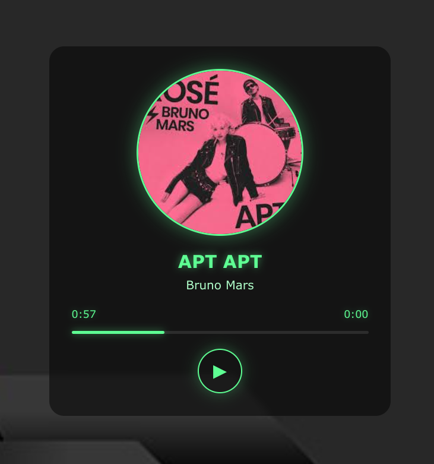

# JS Audio Player

Proyek ini adalah pemutar audio sederhana yang dibuat menggunakan JavaScript.

## Tampilan



## Importan
isi ke file css

```bash
body {
    display: flex;
    justify-content: center;
    align-items: center;
    height: 100vh;
    background-image: url(img/bg.png);
    background-size: cover; 
    margin: 0;
    font-family: 'Segoe UI', Tahoma, Geneva, Verdana, sans-serif;
    color: #fff;

}
.player {
    background: rgba(0, 0, 0, 0.5);
    backdrop-filter: blur(5px);
    width: 400px;
    padding: 30px;
    border-radius: 20px;
    text-align: center;
    transition: transform 0.3s ease;
    position: relative;
}
.player:hover {
    transform: scale(1.02);
}
.cover {
    width: 220px;
    height: 220px;
    border-radius: 50%;
    object-fit: cover;
    margin: 0 auto 20px;
    display: block;
    transition: all 0.5s ease;
    border: 3px solid #5eff93;
    box-shadow: 0 0 25px rgba(94, 255, 147, 0.4);
}
.cover.playing {
    animation: rotate 20s linear infinite;
}
@keyframes rotate {
    from { transform: rotate(0deg); }
    to { transform: rotate(360deg); }
}
h3 {
    margin: 0 0 8px;
    font-size: 24px;
    font-weight: 600;
    text-shadow: 0 0 10px rgba(94, 255, 147, 0.5);
    color: #5eff93;
}
p {
    margin: 0 0 20px;
    font-size: 16px;
    color: #b0ffca;
}
.timer {
    display: flex;
    justify-content: space-between;
    font-size: 14px;
    color: #5eff93;
    margin: 10px 0;
    text-shadow: 0 0 8px rgba(94, 255, 147, 0.3);
}
.progress {
    width: 100%;
    height: 4px;
    background: rgba(255, 255, 255, 0.1);
    border-radius: 2px;
    margin: 15px 0;
    cursor: pointer;
    position: relative;
}
.progress-bar {
    height: 100%;
    background: #5eff93;
    width: 0%;
    border-radius: 2px;
    box-shadow: 0 0 10px rgba(94, 255, 147, 0.5);
    transition: width 0.1s linear;
}
.controls {
    display: flex;
    justify-content: center;
    align-items: center;
    margin-top: 20px;
}
.play-btn {
    background: transparent;
    border: 2px solid #5eff93;
    width: 60px;
    height: 60px;
    border-radius: 50%;
    cursor: pointer;
    font-size: 24px;
    color: #5eff93;
    box-shadow: 0 0 20px rgba(94, 255, 147, 0.3);
    transition: all 0.3s ease;
}
.play-btn:hover {
    background: rgba(94, 255, 147, 0.1);
    transform: scale(1.1);
    box-shadow: 0 0 30px rgba(94, 255, 147, 0.5);
}
```
